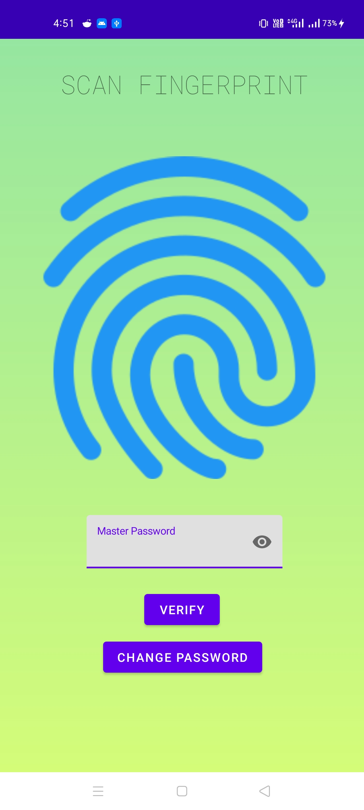
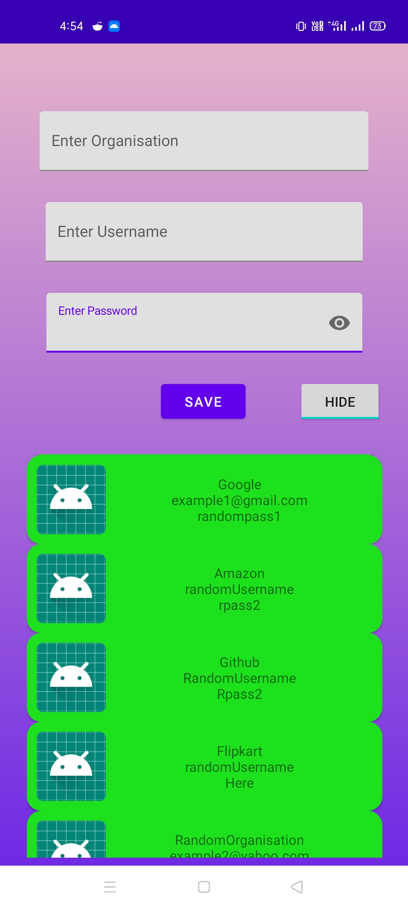

# General desciption and features

### It is a simple password manager which stores your passwords in text format inside a SQLite Database.
### You can login with either a saved password or using your stored fingerprint (same as your device).

 
